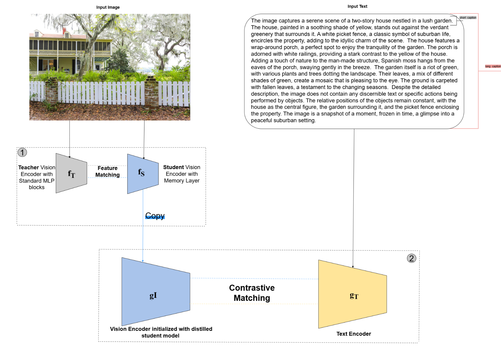
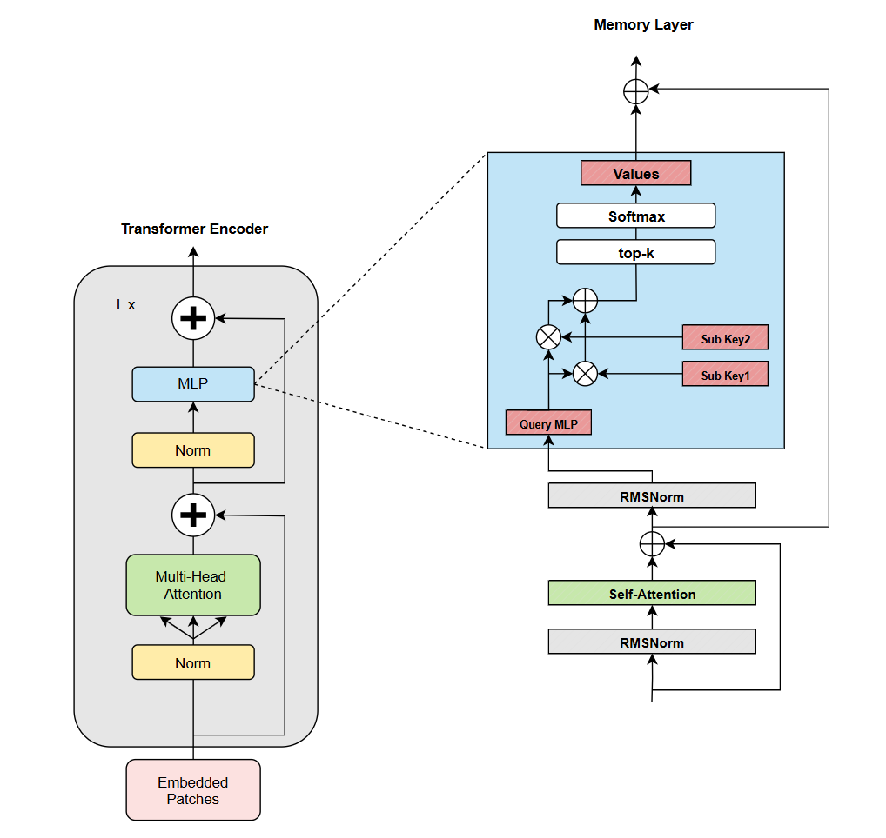

# Memory Augmented CLIP

This is the official repository of my Master's Thesis Project : ***Fine-grained image understanding with VLMs***

## Abstract
Vision-Language Models (VLM) have gained impressive generalization abilities, learning to
identify a vast range of concepts from web-scale data without direct supervision. A key limitation, however, is their difficulty with fine-grained image understanding, often failing to capture
the intricate details that define complex scenes. To address this shortcoming, we propose a
straightforward and efficient method for augmenting frozen foundation models with a persistent memory mechanism. By strategically replacing Multi-Layer Perceptron (MLP) sub-layers
in a Vision Transformer with trainable, key-value memory modules, we enhance the model’s
architectural capacity for detailed feature storage. A teacher-student knowledge distillation
framework is then employed to efficiently transfer knowledge from a pre-trained CLIP model
into our memory-enhanced student, eliminating the need for costly retraining from scratch.
Our results demonstrate that a memory-augmented vision encoder can be effectively trained to
achieve a new level of performance on long-caption fine-grained retrieval benchmarks. Moreover,
they highlight an important trade-off between specialization and generalization. Enhancing
fine-grained retrieval capabilities through this architectural modification can impact performance on pixel-level tasks like zero-shot semantic segmentation. These insights improve our
understanding of how architectural changes affect pre-trained VLM and provide a foundation
for future advancements in developing more comprehensive and efficient models for fine-grained
image understanding.
## Approach

| Knowledge Distillation |
|:--:|
|  <br> *Fig 1. A diagram showing the overall knowledge distillation process.* |

| Memory Layer |
|:--:|
|  <br> *Fig 2. A detailed look at the Memory Layer architecture.* |


## Data

To download datasets as webdataset, we recommend [img2dataset](https://github.com/rom1504/img2dataset). We use [ShareGPT4V](https://github.com/ShareGPT4Omni/ShareGPT4V) dataset for our model's training.

## Training our model 

### Install

We advise you first create a virtual environment with:

```
python3.11 -m venv memory_clip
pip install -U pip
```

You can then install openclip for training with `pip install 'open_clip_torch[training]'`.
Moreover, you can then install the necessary dependencies via the following SLURM job file : 

```
sbatch install_env.job
```

#### Multi-Node 

We make use of `torchrun` to launch distributed jobs. The following launches
a job on a node of 2 GPUs. To utlimately activate our memory-augmented model, the following command is 
responsible `--use-memory` for successfully differentiating a standard CLIP model from ours: 

```bash
cd open_clip/src
torchrun --nproc_per_node 2 -m src.open_clip_train.main -- \
    --save-frequency 1 \
    --train-data="/var/scratch/aibrahim/ShareGPT4V/wds_sharegpt4v/train/{000000..000125}.tar"\
    --val-data="/var/scratch/aibrahim/ShareGPT4V/wds_sharegpt4v/val/000000.tar"   \
    --dataset-type=webdataset \
    --train-num-samples 1245902  \
    --val-num-samples 1000 \
    --use-memory \
    --warmup 1000 \
    --batch-size=20  \
    --accum-freq 4 \
    --lr=5e-4 \
    --wd=0.1 \
    --epochs=10 \
    --workers=4 \
    --grad-checkpointing \
    --model ViT-B-16 \
    --precision amp_bf16 \
    --pretrained "openai" \
    --report-to wandb \
    --log-every-n-steps 100 
```

As seen in the 'Approach' section above, the training process of our model consists of a distillation approach. The first stage, an initial knowledge distillation phase, aims at aligning the memory-augmented encoder with pre-trained vision encoder. More specifically the following job file `jobs/open_clip_distill.job` contains the necessary and in-depth commands for efficiently transferring the global alignment and architecture of a pre-trained model to a leaner model with an encoder infused with memory-layers: 

```
cd open_clip/src
torchrun --nproc_per_node 4 -m src.open_clip_train.main_distill_memory -- \
     --save-frequency 1 \
     --train-data="/var/scratch/aibrahim/ShareGPT4V/wds_sharegpt4v/train/{000000..000125}.tar" \
     --val-data="/var/scratch/aibrahim/ShareGPT4V/wds_sharegpt4v/val/000000.tar"  \
     --train-num-samples 1245902 \
     --val-num-samples 1000 \
     --val-frequency 1 \
     --dataset-type=webdataset \
     --early_stop_patience 3 \
     --early_stop_min_delta 0.005 \
     --dataset_name "sharegpt4v" \
     --use-memory \
     --warmup 1000 \
     --batch-size=20  \
     --accum-freq 4 \
     --lr=5e-4 \
     --wd=0.1 \
     --epochs=40 \
     --workers=2 \
     --grad-checkpointing \
     --model ViT-B-16 \
     --precision amp_bf16 \
     --pretrained "openai" \
     --report-to wandb \
     --loss-type "cosine" \
     --log-every-n-steps 100 
```

After distilling knowledge from a larger model to a leaner one, the distillation phase is followed by a contrastive fine-tuning phase to adapt the model for specific downstream tasks. More commands can be found in `jobs/open_clip_finetune.job`:

```
cd open_clip/src
torchrun --nproc_per_node 4 -m src.open_clip_train.main_vision_context_finetune -- \
    --train-data="/var/scratch/aibrahim/ShareGPT4V/wds_sharegpt4v/train/{000000..000125}.tar" \
    --train-num-samples 1245902 \
    --val-data="/var/scratch/aibrahim/ShareGPT4V/wds_sharegpt4v/val/000000.tar"  \
    --val-num-samples 1000 \
    --dataset-type=webdataset \
    --dataset_name "sharegpt4v" \
    --val-frequency 1 \
    --save-frequency 1 \
    \
    --grad-checkpointing \
    --model ViT-B-16 \
    --precision amp_bf16 \
    --pretrained "openai" \
    \
    --use-memory \
    --warmup 1000 \
    --batch-size=32   \
    --accum-freq 2 \
    --lr=1e-5 \
    --wd=0.1 \
    --epochs=10 \
    --workers=8 \
    \
    --student-model '' \
    --report-to wandb \
    --wandb-project-name "" \
    --loss-type "cosine" \
    --logs="" \
    --log-every-n-steps 100 
```

## Evaluation

Lastly, to evaluate our model on cross-modal retrieval tasks run the following command below. For further potential insights and augmentations of inference, the slurm job stored in `jobs/inference.job` contains more detailed commands:

```
cd open_clip
torchrun --nproc_per_node 1 -m eval_run -- \
    --model ViT-B-16 \
    --pretrained "openai" \
    --distilled_model_path "" \
    --use-memory \
    \
    --coco-data-root-dir  ${DATA_DIR}/coco \
    --flickr-data-root-dir  ${DATA_DIR}/flickr30k-images \
    --iiw-retrieval-dir  ${DATA_DIR}/imageinwords/ \
    --docci-retrieval-dir  ${DATA_DIR}/docci \
    --urban-1k-retrieval-dir  ${DATA_DIR}/Urban1k \
    --dci-retrieval-dir  ${DATA_DIR}/dci \
    \
    --retrieval-flickr \
    --retrieval-coco \
    --retrieval-docci \
    --retrieval-urban-1k \
    --retrieval-iiw \
    --retrieval-dci \
    \
    --batch-size 128 \
    --precision amp_bf16 \
    --workers 25 \
    \
    --name "" \
    --logs "" \
    --report-to json wandb \
    --wandb-project-name ""
```


## Acknowledgements 

Current development of this repository is based on [CLIP](https://github.com/openai/CLIP). Moreover, several training, distillation and evaluation code has relied on the existing the work of [TULIP](https://github.com/ivonajdenkoska/tulip) , [FLAIR](https://github.com/ExplainableML/flair) & [SCLIP](https://github.com/wangf3014/SCLIP)
